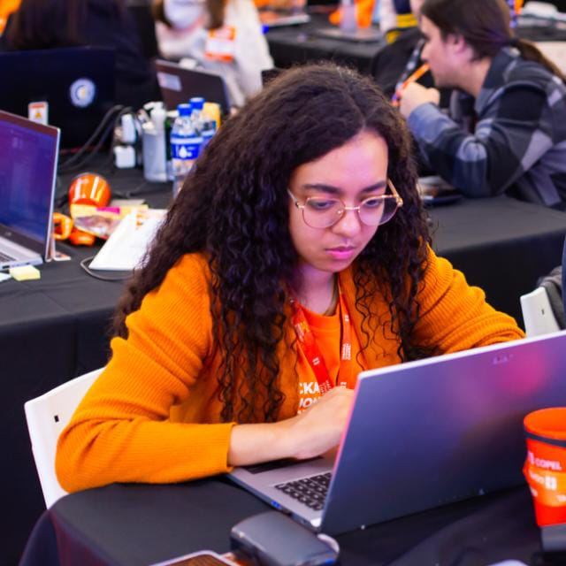

<html lang="pt-br">
<head>
    <meta charset="UTF-8">
    <meta name="viewport" content="width=device-width, initial-scale=1.0">
    <!--Link do icone email-->
    <link rel="stylesheet" href="https://fonts.googleapis.com/css2?family=Material+Symbols+Outlined:opsz,wght,FILL,GRAD@20..48,100..700,0..1,-50..200&icon_names=mail" />
    <!--Link do icone linkedin-->
    <link rel="stylesheet" href="https://fonts.googleapis.com/css2?family=Material+Symbols+Outlined:opsz,wght,FILL,GRAD@20..48,100..700,0..1,-50..200&icon_names=work" />
    <!--Link icone Endereço-->
    <link rel="stylesheet" href="https://fonts.googleapis.com/css2?family=Material+Symbols+Outlined:opsz,wght,FILL,GRAD@20..48,100..700,0..1,-50..200&icon_names=location_on" />
    <title>Currículo</title>
    <!--Link css-->
    <link rel="stylesheet" href="estilo/estilo.css">
    <!--Link Font-->
    <link href="https://fonts.googleapis.com/css2?family=Crimson+Text:ital,wght@0,400;0,600;0,700;1,400;1,600;1,700&family=Host+Grotesk:ital,wght@0,300..800;1,300..800&display=swap" rel="stylesheet">
    

</head>
<body style="background-color: rgb(255, 255, 240);">
    <header>
        <h1 id="titulo">Jad Martins de Lima</h1>
        <figure>
            
            
            <figcaption>
             Imagem de perfil
            </figcaption>
        </figure>
    </header>
    <main>
        <ul>
            <li>
                mail
                Email: <a href="mailto:jadmartins936@gmail.com">jadmartins936@gmail.com</a>
            </li>

            <li>
                work
                Linkedin: <a href="https://www.linkedin.com/in/jad-martins-ab2b75218?utm_source=share&utm_campaign=share_via&utm_content=profile&utm_medium=android_app ">Perfil no Linkedin</a>
            </li>

            <li>
                location_on
                Cornélio Procópio, Paraná</li>
        </ul>
    <h2>Resumo</h2>
        
Estudante de Tecnologia em Análise e Desenvolvimento de Sistemas na
            da Universidade Tecnológica Federal do Paraná (UTFPR), é Técnica em
            Informática para Internet pela Etec Pedro Darcadia
            Neto. Participou de cursos de inglês;
            redação; informática básica e avançada e edição de vídeo pelo CEDET em parceria com a Fema, de 2017 a 2023.

            
Seus principais interesses são Arte, inovação, jogos digitais e esportes

    <section>
    <h3>ODS que desejo contribuir</h3>
    
    
    </section>        
    <h3>Habilidades</h3>
            <ol>
                <li>Design UX/UI</li>
                <li>Pintura em tela</li>
                <li>Programação Front-wend com HTML, CSS e Javascript</li>
                <li>Lógica de programação</li>
            </ol>
    <h2>Educação</h2>
                <section>
                    
Graduação em Análise de sitemas (Em andamento)

                    
UTFPR

                    
2024-2027 

                </section>
                <section>
                    
Ensino técnico em informática para Internet

                    
Pedro D'Arcádia Neto

                    
2021 - 2023

                </section>
    <h4>Hobbies</h4>
        
Pintura em tela

        
Desenho a mão

        
Vídeo games

    </main>
    <footer>
        <h6>Links adicionais</h6>
            <ul>
                <li><a href="https://github.com/Jadmartins936?tab=repositories">Perfil no Github</a></li>
            </ul>
        
Jad Martins de Lima

        </footer>
</body>
</html>
